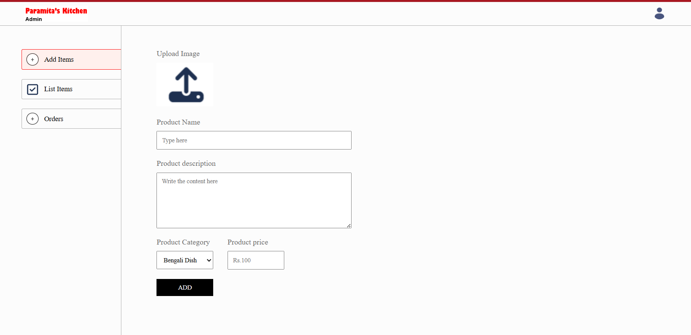

# Food Delivery App

## Introduction
The Food Delivery App is a full-stack MERN (MongoDB, Express, React, Node.js) application that allows users to browse, order, and track food items from various categories. The app features an admin panel for managing the food list, a user-friendly interface for customers, and secure payment processing via Stripe.

## Features

### Browse and Select Foods
- Users can browse a diverse selection of 48 available food items.
- Food items are categorized, making it easy for users to find specific types of food.
- Each food item displays detailed information, including images, descriptions, and prices.

### Admin Functionalities
- **Add Foods:** Admins can add new food items to the list, specifying details such as name, category, description, image, and price.
- **Update Foods:** Admins can edit existing food items to update their information.
- **Delete Foods:** Admins can remove food items from the list.

### Category-Based Food Selection
- Users can filter and view foods based on specific categories (e.g., appetizers, main courses, desserts).
- This feature helps users quickly find the type of food they are looking for.

### Add to Cart and Secure Payment
- **Add to Cart:** Users can add selected food items to their cart. They can view and manage their cart before making a purchase.
- **Modify Cart:** Users can add or remove food items from the cart at any time before completing their purchase.
- **Secure Payment:** Users can proceed to checkout and make secure payments via Stripe, ensuring their payment information is protected.

### Track Order Functionality
- After placing an order, users can track the status of their order in real-time.
- Users receive updates on their order status, from preparation to delivery.

### User Authentication
- **Login:** Users can log in to their accounts to access personalized features and place orders.
- **Logout:** Users can securely log out of their accounts when they are done.
- **Registration:** New users can create an account by registering with their email and password.
- **Account Management:** Users can manage their account details and view their order history.

### Screenshots

## Prerequisites
- Node.js (version 14.x or later)
- npm (version 6.x or later)
- MongoDB (local or cloud instance)
- Stripe account for payment processing
